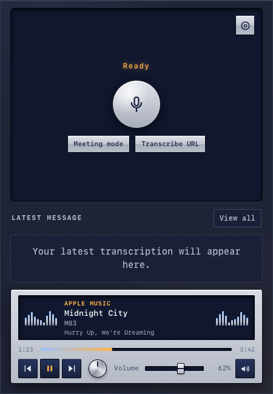

# UltraVox

**Private, on-device transcription for macOS, Windows, and Linux.**
Dictate into any app, transcribe meetings, lectures and media, and keep every recording on your machine. The core is free and open source; an optional Pro license unlocks extra features and funds development.

<p align="center">
  <a href="https://github.com/michael-berardi/ultravox/releases/latest"></a>
  <a href="LICENSE"></a>
  
  
</p>

<p align="center">
  <a href="https://github.com/michael-berardi/ultravox/releases/latest"><strong>Download UltraVox</strong></a>
  ·
  <a href="#privacy"><strong>Privacy</strong></a>
  ·
  <a href="#contributing"><strong>Contributing</strong></a>
</p>

<p align="center">
  
</p>

## Why UltraVox

UltraVox turns speech and media into text without sending recordings to a transcription service. Download a model once, then transcribe microphone recordings, meetings, and system-audio-only lectures locally.

- **On-device transcription** with English and multilingual models.
- **Global recording shortcuts**, including press-to-toggle and hold-to-record modes.
- **Media import** for supported URLs and local audio files.
- **Local history** with search, copy, export, retry, and deletion controls.
- **Custom dictionary** aliases and conservative custom-term correction in every build, with a bundled [dictionary-review skill](docs/dictionary.md) any AI agent can run locally.
- **UltraTerm voice handoff** works in every build: when UltraTerm is the frontmost app, the recording shortcut hands push-to-talk voice input to UltraTerm's own voice flow instead of the native mini-recorder.
- **Pro features** add permissioned, read-only Retex vocabulary scanning, Meeting mode, system-audio-only Lecture mode, macOS Voice Studio for on-device voice cloning and speech generation, macOS now-playing controls, real output-spectrum visuals, and the signature themes.

## The core is free; Pro is optional

The UltraVox core is complete, free, and MIT-licensed: transcription, dictation, history, the manual custom dictionary, themes' free set, UltraTerm voice handoff, and the update checker. You never pay for the core.

An optional **UltraVox Pro license** unlocks the Pro features in the official build. Buying one supports signing, notarization, cross-platform packaging, maintenance, and continued improvements; it is not required to use UltraVox.

| | Core (free, open source) | Pro license (optional) |
|---|---|---|
| License | MIT source | Unlocks Pro features in the official build |
| Platforms | macOS arm64, Windows x86_64, Linux x86_64 | Same |
| Transcription | Microphone, local files, and supported URLs | Same |
| Manual custom dictionary | Included; terms and aliases stay on device | Same |
| Retex vocabulary | Not unlocked; Retex is never invoked | macOS: explicitly selected vaults only; read-only local scan |
| Themes | Midnight, Olive, Nord Frost, Vapor, and the other free themes | The complete theme collection |
| Meeting mode | Not unlocked | System audio and microphone capture |
| Lecture mode | Not unlocked | System audio only; microphone excluded |
| Media panel | Not unlocked | macOS now-playing metadata, transport, volume, and live spectrum |
| Voice Studio | Not unlocked | macOS: on-device voice cloning and speech generation |
| Updates | Public release assets and checksums | Same, plus the authenticated Implose release channel |

Pro licenses are bought and activated in **Settings → Pro**, which also offers a 14-day trial on the current device. A Pro entitlement is a server-signed, device-bound token; it unlocks Pro features in the official build only.

## Voice Studio

Voice Studio on macOS, part of Pro, is powered by FluidAudio PocketTTS. Create a local voice from dictation recordings or an imported WAV (up to ten seconds of reference audio), then generate 24 kHz mono speech from text using a cloned or built-in voice. Models download on first use; cloning and synthesis run on-device. Clone only voices you have permission to use. See the [Voice Studio guide](docs/voice-studio.md) for language packs, CLI commands, storage, and limitations.

## Media players and themes

The media controller follows the active macOS media session used by Control Center. On macOS 15.4 and later, the bundled BSD-licensed system adapter reads the session's title, artist, album, timing, and artwork; the legacy dynamic MediaRemote path remains a fallback. Transport never depends on a browser-specific bridge. If a provider withholds metadata, UltraVox still identifies the active audio app and exposes only honest system-session state.

Every theme uses the same accessible controls but presents them differently:

- **Midnight, Olive, Nord Frost:** restrained, compact utility treatments.
- **Frutiger Aero and Frutiger Dark:** bright sky glass or OLED aurora materials.
- **Solar Dusk and Vapor:** warm analog-meter or neon-grid treatments.
- **Phosphor Classic:** graphite chassis, phosphor display, and segmented meters.
- **Instrument Console:** silver-and-navy instrumentation with mirrored meter banks.
- **Graphite Stack:** stacked dark modules and tactile rectangular controls.
- **Silver Rack:** brushed faceplate, black glass, status lamps, and a rotary dial.
- **OEL Drive:** blue OEL display, cool backlit keys, reactive meters, and a chrome multi-control dial.

Media equalizers use actual system output across eleven frequency bands. Each theme maps those live bands to its own visual treatment. Recording meters use only active microphone input. Reactive visuals are off by default; disabling **Settings → Appearance → Reactive meters** removes the spectrum and every audio-driven scene.

## Requirements

- **macOS:** 14+ on Apple Silicon; macOS 15+ for Meeting mode, Lecture mode, and system-audio capture
- **Linux:** x86_64 with WebKitGTK, compatible with the Ubuntu 22.04 baseline
- **Windows:** Windows 10 or 11 on x86_64, using the NSIS installer
- Microphone permission for speech recording
- Accessibility permission when inserting transcripts into another app or using a modifier-only global shortcut
- Screen Recording permission for Meeting mode, Lecture mode, and the optional system-output spectrum meter
- Optional on macOS for Pro Retex vocabulary: an installed `retex` command and one or more vault directories explicitly selected in **Settings → Dictionary**

## Install

Download the official build for your platform from the [latest GitHub release](https://github.com/michael-berardi/ultravox/releases/latest) and verify it against the adjacent SHA-256 manifest.

| System | Release asset |
| --- | --- |
| macOS | `UltraVox-macos-arm64.zip` or `UltraVox-macos-arm64.pkg` |
| Windows | `UltraVox-windows-x86_64-setup.exe` |
| Linux | `UltraVox-linux-x86_64.AppImage` |

Files named `UltraVox-Light-*` and `UltraVox-Pro-*` are the same build under older names, kept so existing installs can update.

macOS packages are Developer ID signed, notarized by Apple, and staple-verified. The app installs to `/Applications/UltraVox.app`. Building from source gives you the same core without the Pro module; see [Build from source](#build-from-source). Both use the same signed application identity, canonical install path, settings directory, and OS permission grants, so upgrading never creates a second permission set.

## Quick start

1. Launch UltraVox and grant only the permissions needed for your workflow.
2. Choose an English or multilingual model and let it download.
3. Set a global shortcut in **Settings → Shortcut**.
4. Press the shortcut, speak, then press it again to transcribe.
5. With an active UltraVox Pro license, use **Meeting mode** for system audio plus microphone, or **Lecture mode** for system audio only.

## Privacy

Transcription and dictionary post-processing run on your device. After a selected model is downloaded, microphone recordings can be transcribed offline. Meeting capture is a Pro feature on macOS. Media URL import still requires network access to retrieve the source.

Manual dictionary text stays in local UltraVox settings. On macOS with Pro unlocked, UltraVox does not inspect an Obsidian vault directly: it invokes Retex 1.2.0 or newer read-only as `retex vocabulary --vault <selected> --limit 10000 --raw-json`, locally ranks those bounded candidates, retains at most 256 terms, and only does so after the user completes the **Settings → Dictionary** permission wizard. Retex deterministically scans local records and returns only bounded canonical terms and aggregate counts; UltraVox never receives raw note bodies, excerpts, or paths. UltraVox ranks returned terms against recent on-device transcript text so likely mishearings are retained, but transcript text is never passed to Retex or uploaded. Removing a selected vault revokes permission and clears generated vocabulary; manual entries remain.

## Updates

UltraVox checks for stable updates at launch and at most once per day, against the public release assets of the canonical repository. Every candidate must pass its immutable SHA-256 manifest; macOS additionally requires the canonical Developer ID, sealed code, designated requirement, and notarization ticket. Licensed installs may also use the authenticated Implose channel. Failed verification leaves the installed version untouched.

## Licensing

UltraVox source is available under the [MIT License](LICENSE). The Pro module linked into official builds is proprietary: it is not part of this repository and is licensed separately by Implose Cybernetics. Pro services, private release infrastructure, and commercial entitlements are provided separately as well.

The MIT license does not grant rights to the UltraVox or Implose Cybernetics names, logos, or other brand assets. Third-party rights remain with their respective owners. See [LEGAL_NOTICES.md](LEGAL_NOTICES.md) and [`apps/desktop/LEGAL_NOTICES.md`](apps/desktop/LEGAL_NOTICES.md) for bundled notices.

No secrets, signing identities, or service credentials belong in the public repository.

## Build from source

Prerequisites: Node.js 22, pnpm 10, Rust, CMake, libomp, and Xcode Command Line Tools.

```bash
git clone --recurse-submodules https://github.com/michael-berardi/ultravox.git
cd ultravox
brew install cmake libomp rust node@22
export PATH="$(brew --prefix node@22)/bin:$PATH"
npm install --global pnpm@10.27.0
pnpm install --frozen-lockfile

# Checks and tests
pnpm desktop:check
cargo test --workspace
pnpm test:all           # cargo tests + desktop tests + release contract

# Build the open-source app (Pro module not included)
pnpm --filter ultravox-desktop tauri build --no-default-features --features custom-protocol
```

The official builds are produced by the signed Implose release workflow, which additionally links the closed Pro module. A plain local Tauri macOS bundle is ad-hoc signed. Do not install it over the canonical app when testing permission continuity: macOS ties Accessibility, Microphone, and Screen Recording grants to the designated signing requirement. Installed QA candidates must use the stable Developer ID app-only packaging workflow; published builds additionally require notarization.

### Headless visual QA

The development build includes a deterministic browser-renderable theme harness. It never ships in production builds.

```bash
pnpm desktop:qa:headless
# Example:
# http://127.0.0.1:1420/?qa-theme=midnight&qa-state=playing&qa-source=music
```

Supported fixture sources include `music`, `youtube-music`, and `youtube`; playback states include `playing`, `paused`, `unknown`, and `volume-unavailable`. The YouTube Music fixture includes deterministic inline artwork. Use `qa-spectrum=low|mid|high` for fixed band shapes that prove each atmosphere responds without random or time-based motion. Add `qa-reactive=0` to remove all reactive DOM, `qa-recording-level=0.75` for active microphone levels, `qa-drop=1` for drag/drop, or `qa-transcription-ms=1600` for delayed status timing.

## Architecture

- **Tauri + React** provide the desktop shell and accessible interface.
- **Rust** handles application state, audio, history, in-memory dictionary processing, permissioned Retex command invocation, downloads, and CLI tooling.
- **Swift/FluidAudio bridges** provide native macOS transcription, permissions, accessibility, meetings, and system audio.
- **Whisper.cpp** provides local transcription on Windows and Linux.
- **The Pro module** (`apps/desktop/src-tauri/src/pro/`, `apps/desktop/src/pro/`) is compiled only into official builds and stays locked without a valid entitlement; the open-source build links stubs in its place.

Optional platform integrations degrade safely when metadata or permissions are unavailable. Transcription history and audio stay on the device.

## Contributing

Issues and focused pull requests are welcome; see [CONTRIBUTING.md](CONTRIBUTING.md). Report vulnerabilities privately as described in [SECURITY.md](SECURITY.md).

1. Search existing issues before opening a duplicate.
2. Describe the user-visible behavior, operating system version, and reproduction steps.
3. Keep changes scoped and include tests for new observable behavior.
4. Run the checks in [Build from source](#build-from-source) before submitting.

Please do not include recordings, transcripts, credentials, private URLs, or personal system details in issues.

## License and acknowledgements

UltraVox source is available under the [MIT License](LICENSE); the Pro module in official builds is proprietary and licensed separately. It builds on open-source work including:

- [OpenSuperWhisper](https://github.com/Starmel/OpenSuperWhisper)
- [whisper.cpp](https://github.com/ggerganov/whisper.cpp)
- [FluidAudio](https://github.com/FluidInference/FluidAudio)
- [autocorrect](https://github.com/huacnlee/autocorrect)

Third-party licenses and notices remain with their respective projects. See [`apps/desktop/LEGAL_NOTICES.md`](apps/desktop/LEGAL_NOTICES.md) for bundled notices.
