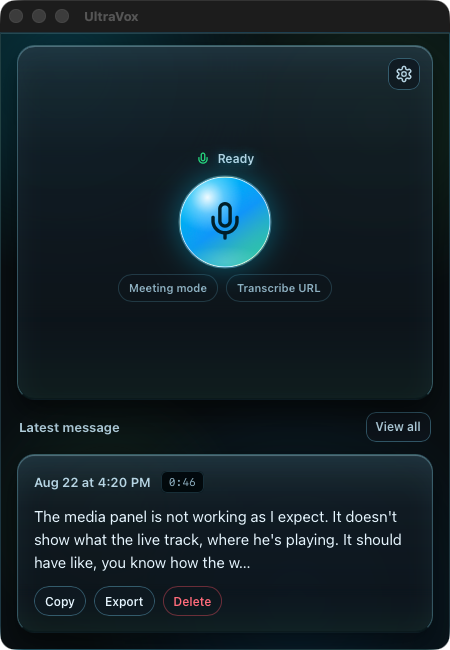
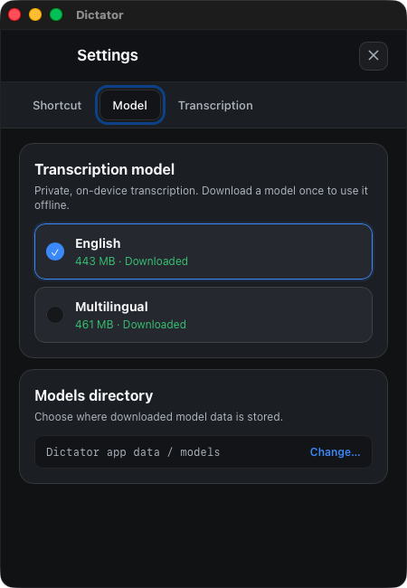

# UltraVox

UltraVox is a private, on-device macOS transcription app for microphone recordings, meeting capture, and supported media URLs.

<p align="center">
  
  
</p>

## Features

- On-device transcription with downloadable English and multilingual models.
- Microphone recording with configurable global shortcuts.
- Hold-to-record mode: hold the shortcut to record, then release to stop.
- Meeting mode for repeated capture, with each segment queued for transcription.
- Optional Google Meet and Zoom reminders from the local [OverSeer Browser](https://github.com/michael-berardi/overseer-browser) extension. UltraVox receives a minimized local event containing a schema version, random detection ID, provider name, opaque meeting key, and millisecond detection time, then waits for explicit recording consent.
- Supported media URL import and queued processing.
- Language auto-detection for supported models.

## Architecture

The canonical app is a Rust/Tauri v2 desktop application backed by the shared `ultravox-core` crate. The original SwiftUI implementation remains in `UltraVox/` as a reference during the migration. Current development, build, and release workflows target the Tauri app.

## Installation

Prebuilt Apple Silicon releases include both `UltraVox.app` and the
`ultravox-control` CLI. The installer verifies the published SHA-256 checksum
and macOS code signature before replacing anything.

For an AI agent or a user account install (no compiler or `sudo` required):

```bash
curl -fsSL https://raw.githubusercontent.com/michael-berardi/ultravox/master/install.sh | bash
```

This installs the app to `~/Applications/UltraVox.app` and the CLI to
`~/.local/bin/ultravox-control`. For a machine-wide install:

```bash
curl -fsSL https://raw.githubusercontent.com/michael-berardi/ultravox/master/install.sh | bash -s -- --system
```

Release assets are also available from
[GitHub Releases](https://github.com/michael-berardi/ultravox/releases).

## Requirements

- macOS (Apple Silicon/ARM64)

## Support

If you encounter any issues or have questions, please:
1. Check the existing issues in the repository
2. Create a new issue with detailed information about your problem
3. Include system information and logs when reporting bugs

## Building locally

Requirements: macOS on Apple Silicon, Node.js 22, pnpm 10.27.0, Rust, CMake, and libomp.

```bash
git clone https://github.com/michael-berardi/ultravox.git
cd ultravox
git submodule update --init --recursive
brew install cmake libomp rust node@22
npm install --global pnpm@10.27.0
pnpm install --frozen-lockfile
./run.sh build
```

## Publishing a release

Releases are built locally, Developer ID signed, notarized, checksum-staged,
and published without GitHub Actions:

```bash
export APPLE_SIGNING_IDENTITY=\"Developer ID Application: …\"
export APPLE_INSTALLER_SIGNING_IDENTITY=\"Developer ID Installer: …\"
export NOTARYTOOL_PROFILE=\"your-keychain-profile\"
pnpm release:publish
```

`pnpm release:package` only stages the `.zip`, `.pkg`, and checksum assets in
`release/`. Publishing additionally requires an authenticated GitHub CLI.


## Contributing

Contributions are welcome! Please feel free to submit pull requests or create issues for bugs and feature requests.

## License

UltraVox is licensed under the MIT License. The root [LICENSE](LICENSE) preserves the OpenSuperWhisper notice and covers Implose Labs modifications.

This project is based on [OpenSuperWhisper](https://github.com/Starmel/OpenSuperWhisper) by Starmel.

## Credits & Third-Party Software

UltraVox includes or depends on the following open-source projects:

- [OpenSuperWhisper](https://github.com/Starmel/OpenSuperWhisper) — MIT License
- [Whisper.cpp](https://github.com/ggerganov/whisper.cpp) — MIT License
- [FluidAudio](https://github.com/FluidInference/FluidAudio) — used under its respective license
- [autocorrect](https://github.com/huacnlee/autocorrect) — used under its respective license

All third-party licenses and notices remain the property of their respective owners.

## Privacy and models

Transcription runs on-device. After the selected model is downloaded from Hugging Face, microphone recording and meeting capture can be transcribed offline. Media URL import still requires network access to download the source.

Browser meeting reminders are opt-in and local. The extension does not send UltraVox meeting URLs, titles, participants, or page contents, and UltraVox never starts recording until **Start recording** is selected in its visible reminder.
